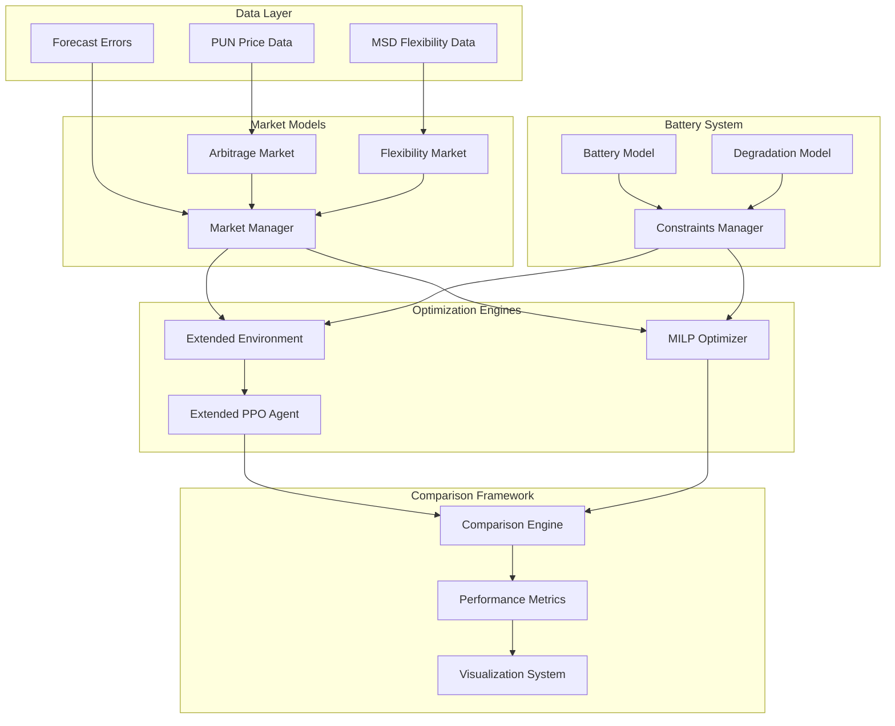

# Design Document

## Overview

Questo documento descrive il design per estendere il sistema esistente di trading di batterie DRL PPO per includere i servizi di flessibilità secondo la normativa italiana, e implementare un ottimizzatore MILP per il confronto delle performance. Il sistema manterrà la struttura modulare esistente e aggiungerà nuovi componenti per la modellazione dei servizi di flessibilità e l'ottimizzazione MILP.

## Architecture

Il sistema esteso seguirà un'architettura modulare con i seguenti componenti principali:



## Components and Interfaces

### 1. Flexibility Market Model

Il modello dei servizi di flessibilità implementa la normativa italiana ARERA:

**Interfaccia FlexibilityMarket:**
```python
class FlexibilityMarket:
    def get_flexibility_opportunities(self, hour: int) -> List[FlexibilityService]
    def calculate_capacity_revenue(self, service: FlexibilityService, capacity_mw: float) -> float
    def calculate_activation_revenue(self, service: FlexibilityService, energy_mwh: float) -> float
    def check_service_constraints(self, service: FlexibilityService, bess_state: BatteryState) -> bool
```

**Tipi di Servizi:**
- **FCR (Frequency Containment Reserve)**: Riserva primaria, risposta ≤ 30s
- **aFRR (automatic Frequency Restoration Reserve)**: Riserva secondaria, risposta ≤ 200s  
- **mFRR (manual Frequency Restoration Reserve)**: Riserva terziaria, risposta ≤ 15min

### 2. Extended PPO Environment

L'ambiente esteso mantiene compatibilità con il sistema esistente:

**Observation Space (35 features):**
- SOC corrente (1)
- Prezzi forecast arbitraggio (24)
- Prezzi correnti arbitraggio (1)
- Opportunità flessibilità FCR (3: disponibile, prezzo_capacity, prezzo_energy)
- Opportunità flessibilità aFRR (3: disponibile, prezzo_capacity, prezzo_energy)
- Opportunità flessibilità mFRR (3: disponibile, prezzo_capacity, prezzo_energy)

**Action Space (Discrete 31 actions):**
- Arbitraggio: 21 azioni discrete da -2MW a +2MW
- FCR: 4 azioni (0%, 25%, 50%, 75% capacità disponibile)
- aFRR: 3 azioni (0%, 50%, 100% capacità disponibile)  
- mFRR: 3 azioni (0%, 50%, 100% capacità disponibile)

### 3. MILP Optimizer

Il modello MILP ottimizza simultaneamente arbitraggio e servizi di flessibilità:

**Variabili di Decisione:**
- `P_charge[t]`: Potenza di carica all'ora t [MW]
- `P_discharge[t]`: Potenza di scarica all'ora t [MW]
- `SOC[t]`: State of Charge all'ora t [MWh]
- `R_fcr[t]`: Capacità riservata per FCR all'ora t [MW]
- `R_afrr[t]`: Capacità riservata per aFRR all'ora t [MW]
- `R_mfrr[t]`: Capacità riservata per mFRR all'ora t [MW]
- `A_fcr[t]`: Attivazione FCR all'ora t [MW]
- `A_afrr[t]`: Attivazione aFRR all'ora t [MW]
- `A_mfrr[t]`: Attivazione mFRR all'ora t [MW]

**Funzione Obiettivo:**
```
Maximize: Σ_t [
    - (P_charge[t] - P_discharge[t]) * Price_energy[t]  # Arbitraggio
    + R_fcr[t] * Price_fcr_capacity[t]                  # Ricavi capacità FCR
    + R_afrr[t] * Price_afrr_capacity[t]                # Ricavi capacità aFRR  
    + R_mfrr[t] * Price_mfrr_capacity[t]                # Ricavi capacità mFRR
    + A_fcr[t] * Price_fcr_energy[t]                    # Ricavi attivazione FCR
    + A_afrr[t] * Price_afrr_energy[t]                  # Ricavi attivazione aFRR
    + A_mfrr[t] * Price_mfrr_energy[t]                  # Ricavi attivazione mFRR
    - Degradation_cost[t]                               # Costi degrado
]
```

**Vincoli Principali:**
1. **Bilancio energetico:** `SOC[t+1] = SOC[t] + η*P_charge[t] - P_discharge[t]/η`
2. **Limiti SOC:** `SOC_min ≤ SOC[t] ≤ SOC_max`
3. **Limiti potenza:** `P_charge[t], P_discharge[t] ≤ P_max`
4. **Vincoli riserva:** `P_charge[t] + R_fcr[t] + R_afrr[t] + R_mfrr[t] ≤ P_max`
5. **Vincoli attivazione:** `A_fcr[t] ≤ R_fcr[t]`, `A_afrr[t] ≤ R_afrr[t]`, `A_mfrr[t] ≤ R_mfrr[t]`

### 4. Market Data Integration

**Dati Storici Italiani:**
- Prezzi PUN orari (già disponibili)
- Prezzi servizi MSD da dati GME
- Probabilità attivazione servizi da analisi storica
- Tariffe BSP secondo normativa ARERA

## Data Models

### FlexibilityService
```python
@dataclass
class FlexibilityService:
    service_type: str  # 'FCR', 'aFRR', 'mFRR'
    capacity_price: float  # EUR/MW/h
    energy_price: float    # EUR/MWh
    activation_probability: float  # [0,1]
    response_time: int     # seconds
    min_capacity: float    # MW
    max_duration: int      # hours
```

### BatteryState
```python
@dataclass
class BatteryState:
    soc: float           # [0,1]
    available_power: float  # MW
    reserved_fcr: float     # MW
    reserved_afrr: float    # MW  
    reserved_mfrr: float    # MW
    degradation_cycles: float
```

### OptimizationResult
```python
@dataclass
class OptimizationResult:
    algorithm: str  # 'PPO' or 'MILP'
    arbitrage_profit: float
    flexibility_revenue: float
    degradation_cost: float
    net_profit: float
    execution_time: float
    battery_utilization: float
    final_soh: float
```

## Correctness Properties

*A property is a characteristic or behavior that should hold true across all valid executions of a system-essentially, a formal statement about what the system should do. Properties serve as the bridge between human-readable specifications and machine-verifiable correctness guarantees.*

### Property Reflection

Dopo aver analizzato tutti i criteri di accettazione, ho identificato diverse proprietà che possono essere consolidate per evitare ridondanza:

- Le proprietà sui tempi di risposta dei servizi (1.2, 1.3, 1.4) possono essere unificate in una proprietà generale sui tempi di risposta
- Le proprietà sui calcoli di ricavi (1.5, 5.4) possono essere combinate in una proprietà generale sui calcoli economici
- Le proprietà sui vincoli fisici (2.3, 8.4) sono ridondanti e possono essere unificate
- Le proprietà sulla consistenza dei dataset (4.1, 4.2) possono essere combinate

### Correctness Properties

Property 1: Flexibility Service Response Times
*For any* flexibility service activation request, the BESS response time should be within the regulatory limits: FCR ≤ 30s, aFRR ≤ 200s, mFRR ≤ 15min
**Validates: Requirements 1.2, 1.3, 1.4**

Property 2: ARERA Compliance
*For any* flexibility service request, the BESS response should comply with all ARERA technical parameters including capacity limits, duration constraints, and activation procedures
**Validates: Requirements 1.1**

Property 3: Revenue Calculation Accuracy
*For any* combination of services and quantities, the revenue calculation should correctly apply ARERA tariffs, GME settlement rules, and include all applicable costs and fees
**Validates: Requirements 1.5, 5.4, 5.3**

Property 4: Conflict Resolution Consistency
*For any* scenario where arbitrage and flexibility services conflict, the optimization system should consistently apply the configured prioritization strategy
**Validates: Requirements 1.6**

Property 5: MILP Constraint Satisfaction
*For any* MILP optimization solution, all physical BESS constraints (power limits, capacity limits, SOC bounds) and market constraints should be satisfied
**Validates: Requirements 2.3, 8.4**

Property 6: MILP Optimality
*For any* set of forecast prices and market conditions, the MILP optimizer should produce a solution that is mathematically optimal for the given objective function and constraints
**Validates: Requirements 2.1, 2.2**

Property 7: Degradation Model Integration
*For any* optimization algorithm (PPO or MILP), the battery degradation cost should be correctly included in the objective function calculation
**Validates: Requirements 2.4**

Property 8: Rolling Horizon Consistency
*For any* rolling horizon configuration, the MILP optimizer should maintain solution consistency across overlapping time windows
**Validates: Requirements 2.6**

Property 9: PPO Backward Compatibility
*For any* existing arbitrage test case, the extended PPO system should produce equivalent results when flexibility services are disabled
**Validates: Requirements 3.1, 3.5**

Property 10: Extended Action Space Completeness
*For any* training episode, the extended PPO action space should include all flexibility service options alongside existing arbitrage actions
**Validates: Requirements 3.2**

Property 11: Forecast Error Distribution Consistency
*For any* error distribution type, both PPO and MILP systems should use identical forecast error sequences for fair comparison
**Validates: Requirements 3.3, 4.2**

Property 12: Reward Function Completeness
*For any* PPO step, the reward calculation should include arbitrage profits, flexibility revenues, and degradation costs when applicable
**Validates: Requirements 3.4**

Property 13: Observation Space Completeness
*For any* environment state, the extended observation space should include current market conditions for both arbitrage and all available flexibility services
**Validates: Requirements 3.6**

Property 14: Comparison Fairness
*For any* performance comparison, both algorithms should be evaluated on identical datasets, market conditions, and error distributions
**Validates: Requirements 4.1, 4.3**

Property 15: Market Data Authenticity
*For any* market model instantiation, the system should use authentic Italian market data: PUN prices for arbitrage and MSD tariffs for flexibility services
**Validates: Requirements 5.1, 5.2**

Property 16: Service Participation Constraints
*For any* flexibility service, the system should enforce minimum participation requirements and capacity constraints as per Italian regulations
**Validates: Requirements 5.5**

Property 17: Historical Probability Modeling
*For any* flexibility service, the activation probability should be derived from historical MSD data and reflect realistic market conditions
**Validates: Requirements 5.6**

Property 18: Robustness Testing Completeness
*For any* robustness analysis, the test system should evaluate performance across all four existing forecast error distributions
**Validates: Requirements 6.1**

Property 19: Performance Degradation Measurement
*For any* extreme forecast error scenario, the system should quantify and report the performance degradation for both algorithms
**Validates: Requirements 6.3**

Property 20: Visualization Completeness
*For any* results visualization, the system should generate comparative plots for profits, SOC evolution, battery utilization, and flexibility service usage
**Validates: Requirements 7.1, 7.3**

Property 21: Statistical Analysis Integration
*For any* generated report, comprehensive statistical analysis should be included covering performance metrics, confidence intervals, and significance tests
**Validates: Requirements 7.2**

Property 22: Service Type Differentiation
*For any* flexibility results display, the visualization should clearly distinguish between FCR, aFRR, and mFRR services in terms of usage patterns and revenues
**Validates: Requirements 7.4**

Property 23: Export Format Consistency
*For any* generated visualization, the system should export both interactive formats and high-resolution PDF versions
**Validates: Requirements 7.5, 7.6**

Property 24: MILP Model Validation
*For any* MILP model instance, unit tests should verify mathematical correctness of constraints, objective function, and solution feasibility
**Validates: Requirements 8.1**

Property 25: Integration Consistency
*For any* extended PPO functionality, integration tests should verify behavioral consistency with the original PPO implementation for overlapping features
**Validates: Requirements 8.2**

Property 26: Benchmark Validation
*For any* flexibility revenue calculation, the results should match known benchmarks and regulatory examples within acceptable tolerance
**Validates: Requirements 8.3**

Property 27: Algorithm Convergence
*For any* optimization algorithm in boundary conditions, the system should demonstrate convergence or provide meaningful error handling
**Validates: Requirements 8.5**

Property 28: Result Reproducibility
*For any* algorithm execution with fixed random seeds, multiple runs should produce consistent results within statistical tolerance
**Validates: Requirements 8.6**

<function_calls>
<invoke name="prework">
<parameter name="featureName">battery-flexibility-milp-comparison

## Error Handling

### 1. Market Data Errors
- **Missing Price Data**: Interpolazione lineare per gap brevi, fallback a prezzi storici medi per gap lunghi
- **Invalid Tariff Data**: Validazione range e fallback a tariffe ARERA standard
- **Forecast Error Bounds**: Clipping automatico degli errori ai limiti configurati [-15%, +15%]

### 2. Optimization Errors
- **MILP Infeasibility**: Rilassamento progressivo dei vincoli non critici e logging dettagliato
- **PPO Training Instability**: Early stopping con checkpoint automatici e rollback
- **Convergence Failures**: Timeout configurabili con soluzioni sub-ottimali accettabili

### 3. Battery Constraint Violations
- **SOC Violations**: Penalizzazione nella reward function e correzione automatica
- **Power Limit Violations**: Clipping delle azioni e logging per analisi
- **Degradation Model Errors**: Fallback a modello lineare semplificato

### 4. System Integration Errors
- **Data Format Mismatches**: Validazione automatica e conversione con warning
- **Version Compatibility**: Controlli di compatibilità con sistema PPO esistente
- **Resource Limitations**: Gestione memoria e timeout per ottimizzazioni complesse

## Testing Strategy

### Dual Testing Approach
Il sistema utilizzerà un approccio di testing duale che combina:

- **Unit Tests**: Verificano componenti specifici, casi limite, e condizioni di errore
- **Property-Based Tests**: Verificano proprietà universali attraverso input randomizzati
- Entrambi sono complementari e necessari per una copertura completa

### Property-Based Testing Configuration
- **Framework**: Hypothesis per Python (generazione automatica di test cases)
- **Iterazioni Minime**: 100 iterazioni per test di proprietà (per robustezza statistica)
- **Tag Format**: `# Feature: battery-flexibility-milp-comparison, Property {number}: {property_text}`
- **Seed Management**: Semi fissi per riproducibilità, semi casuali per robustezza

### Unit Testing Focus
I unit test si concentreranno su:
- **Esempi Specifici**: Casi di test deterministici per validazione funzionale
- **Punti di Integrazione**: Interfacce tra componenti PPO, MILP, e market models
- **Casi Limite**: Condizioni estreme di mercato, errori di forecast, vincoli batteria
- **Backward Compatibility**: Mantenimento funzionalità esistenti del sistema PPO

### Test Categories

#### 1. Market Model Tests
- Validazione calcoli ricavi secondo tariffe ARERA
- Correttezza probabilità attivazione servizi
- Gestione dati storici PUN e MSD

#### 2. MILP Optimization Tests  
- Verifica vincoli fisici e di mercato
- Ottimalità soluzioni in scenari noti
- Performance rolling horizon optimization

#### 3. PPO Extension Tests
- Backward compatibility con sistema esistente
- Correttezza extended action/observation space
- Integrazione reward function con flessibilità

#### 4. Comparison Framework Tests
- Fairness confronti (stessi dataset, errori, condizioni)
- Accuratezza metriche performance
- Robustezza analisi statistiche

#### 5. Integration Tests
- End-to-end workflow PPO vs MILP
- Consistenza risultati attraverso pipeline completa
- Gestione errori e recovery scenarios

### Performance Testing
- **Scalabilità**: Test con orizzonti temporali crescenti (24h, 168h, 8760h)
- **Robustezza**: Valutazione performance con diverse distribuzioni errore
- **Benchmark**: Confronto tempi esecuzione PPO vs MILP
- **Memory Usage**: Profiling utilizzo memoria per ottimizzazioni complesse

### Validation Against Real Data
- **Historical Backtesting**: Validazione su dati storici 2023-2024
- **Regulatory Compliance**: Verifica conformità normativa ARERA
- **Market Reality Check**: Confronto risultati con performance reali BESS italiani

Ogni proprietà di correttezza sarà implementata come singolo test property-based, con riferimento esplicito al numero della proprietà nel design document per tracciabilità completa.